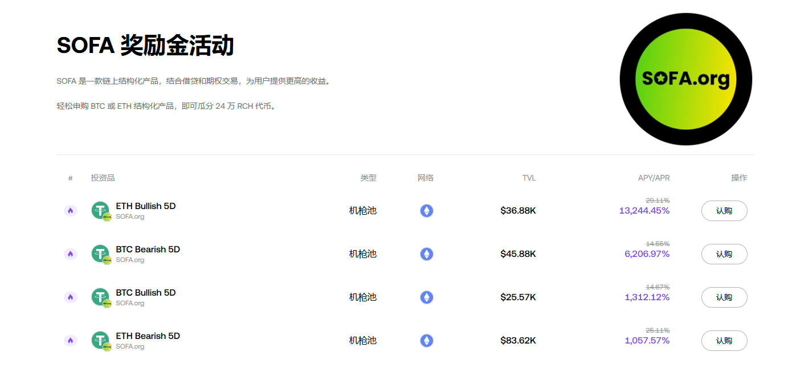

## 监控okx web3新赚币活动



## 编辑 `.env` 文件，设置推送环境变量， 示例：

vim .env

```bash
BARK_PUSH='xxx'
WATCH_INTERVAL=60
```

## 运行代码

```bash
pip install -r requirements.txt
python main.py
 ```

## docker 运行

```bash
docker compose build
docker compose up -d
```
